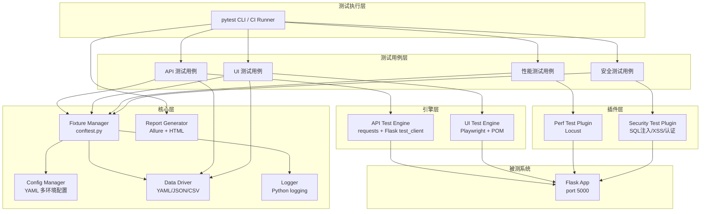
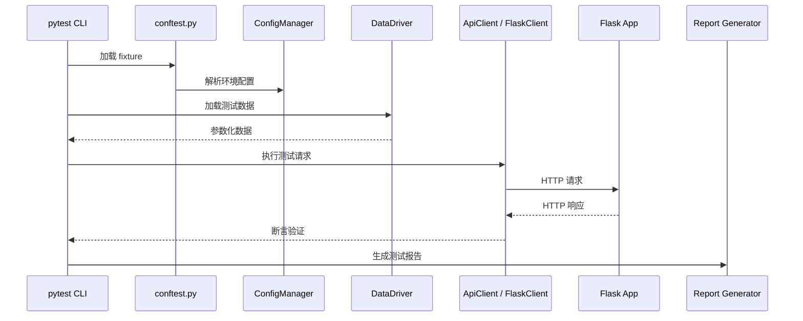

# 技术设计文档：pytest 自动化测试框架

## 概述

本设计文档描述基于 pytest 构建的自动化测试框架的技术架构。该框架服务于当前 Flask API 项目（运行在 port 5000），提供 API 测试、UI 测试、性能测试和安全测试能力。框架采用分层架构，核心层提供配置管理、fixture 管理和数据驱动能力，引擎层封装 HTTP 客户端和浏览器驱动，插件层提供可扩展的性能和安全测试支持。

### 设计目标

- 分层清晰：conftest → fixtures → utils → engines → plugins
- 零侵入：不修改被测 Flask 应用代码
- 数据驱动：测试数据与测试逻辑分离
- 可扩展：通过 pytest marker 和插件机制支持多种测试类型
- CI 友好：支持命令行控制、JUnit XML 输出、headless 模式

## 架构

### 整体架构图



### 分层职责

| 层级 | 职责 | 关键组件 |
|------|------|----------|
| 测试执行层 | 测试调度、参数解析、marker 过滤 | pytest CLI, conftest.py |
| 测试用例层 | 具体测试场景实现 | test_*.py 文件 |
| 引擎层 | HTTP 请求封装、浏览器操作封装 | ApiClient, PageObject |
| 插件层 | 性能/安全测试扩展 | locustfile, security scanners |
| 核心层 | 配置、数据、日志、报告 | ConfigManager, DataDriver, Logger |

## 组件与接口

### 目录结构

```
tests/
├── conftest.py                  # 全局 fixture 和 pytest 配置
├── pytest.ini                   # pytest 配置（markers, 默认参数）
├── config/
│   ├── config.yaml              # 默认配置
│   ├── dev.yaml                 # 开发环境配置
│   ├── staging.yaml             # 预发布环境配置
│   └── prod.yaml                # 生产环境配置
├── fixtures/
│   ├── __init__.py
│   ├── api_fixtures.py          # API 测试 fixture（Flask test_client, HTTP client）
│   └── ui_fixtures.py           # UI 测试 fixture（浏览器实例）
├── utils/
│   ├── __init__.py
│   ├── config_manager.py        # 配置管理器
│   ├── api_client.py            # HTTP 客户端封装
│   ├── data_driver.py           # 数据驱动工具
│   ├── assertions.py            # 自定义断言工具
│   └── logger.py                # 日志工具
├── pages/                       # Page Object Model
│   ├── __init__.py
│   └── base_page.py             # 页面基类
├── testcases/
│   ├── __init__.py
│   ├── api/
│   │   ├── __init__.py
│   │   └── test_login.py        # 登录接口测试
│   ├── ui/
│   │   ├── __init__.py
│   │   └── test_login_page.py   # 登录页面 UI 测试
│   ├── performance/
│   │   ├── __init__.py
│   │   └── locustfile.py        # Locust 性能测试脚本
│   └── security/
│       ├── __init__.py
│       └── test_security.py     # 安全测试用例
├── testdata/
│   ├── login_data.yaml          # 登录测试数据
│   └── login_data.csv           # CSV 格式测试数据
└── reports/                     # 测试报告输出目录
    └── .gitkeep
```


### 组件详细设计

#### 1. ConfigManager（配置管理器）

```python
class ConfigManager:
    """多环境配置管理器，支持 YAML 配置文件加载"""

    def __init__(self, env: str = "dev"):
        """根据环境名加载对应配置文件"""

    def get(self, key: str, default=None) -> Any:
        """获取配置项，支持点号分隔的嵌套 key（如 'api.base_url'）"""

    def get_base_url(self) -> str:
        """获取当前环境的 API base URL"""

    @staticmethod
    def resolve_env() -> str:
        """从命令行参数 --env 或环境变量 TEST_ENV 解析环境名"""
```

配置文件格式（YAML）：

```yaml
# config/dev.yaml
api:
  base_url: "http://localhost:5000"
  timeout: 10
browser:
  type: "chromium"
  headless: true
logging:
  level: "DEBUG"
  file: "reports/test.log"
```

#### 2. ApiClient（HTTP 客户端封装）

```python
class ApiClient:
    """基于 requests 的 HTTP 客户端封装"""

    def __init__(self, base_url: str, timeout: int = 10):
        self.session: requests.Session
        self.base_url: str
        self.timeout: int

    def request(self, method: str, path: str, **kwargs) -> requests.Response:
        """发送 HTTP 请求，自动拼接 base_url，记录请求/响应日志"""

    def get(self, path: str, **kwargs) -> requests.Response: ...
    def post(self, path: str, **kwargs) -> requests.Response: ...
    def put(self, path: str, **kwargs) -> requests.Response: ...
    def delete(self, path: str, **kwargs) -> requests.Response: ...

    def set_token(self, token: str):
        """设置 Authorization header"""

    def get_last_response(self) -> Optional[requests.Response]:
        """获取最近一次响应，用于调试"""
```

#### 3. ResponseAssertions（响应断言工具）

```python
class ResponseAssertions:
    """HTTP 响应断言工具"""

    def __init__(self, response: requests.Response): ...

    def status_code(self, expected: int) -> 'ResponseAssertions':
        """断言状态码"""

    def json_field(self, field_path: str, expected) -> 'ResponseAssertions':
        """断言 JSON 响应中指定字段的值，支持点号路径"""

    def json_has_field(self, field_path: str) -> 'ResponseAssertions':
        """断言 JSON 响应中包含指定字段"""

    def response_time_less_than(self, max_ms: float) -> 'ResponseAssertions':
        """断言响应时间小于指定毫秒数"""
```

#### 4. DataDriver（数据驱动模块）

```python
class DataDriver:
    """测试数据加载器，支持 YAML、JSON、CSV"""

    @staticmethod
    def load_yaml(file_path: str) -> list[dict]: ...

    @staticmethod
    def load_json(file_path: str) -> list[dict]: ...

    @staticmethod
    def load_csv(file_path: str) -> list[dict]: ...

    @staticmethod
    def load(file_path: str) -> list[dict]:
        """根据文件扩展名自动选择加载方式"""
```

与 pytest 集成方式：

```python
@pytest.mark.parametrize("data", DataDriver.load("testdata/login_data.yaml"))
def test_login(api_client, data):
    resp = api_client.post("/api/login", json=data["input"])
    assert resp.status_code == data["expected"]["status_code"]
```

#### 5. UI Test Engine（Page Object Model）

```python
class BasePage:
    """页面对象基类"""

    def __init__(self, page):  # Playwright Page 对象
        self.page = page

    def navigate(self, url: str): ...
    def click(self, selector: str): ...
    def fill(self, selector: str, value: str): ...
    def get_text(self, selector: str) -> str: ...
    def wait_for(self, selector: str, timeout: int = 5000): ...
    def screenshot(self, path: str): ...
```

#### 6. Fixture 设计

```python
# conftest.py 中的核心 fixture

@pytest.fixture(scope="session")
def config():
    """会话级配置管理器"""
    return ConfigManager(env=ConfigManager.resolve_env())

@pytest.fixture(scope="session")
def flask_app():
    """Flask 应用实例"""
    from app import create_app
    app = create_app()
    app.config['TESTING'] = True
    return app

@pytest.fixture
def flask_client(flask_app):
    """Flask 测试客户端"""
    return flask_app.test_client()

@pytest.fixture(scope="session")
def api_client(config):
    """HTTP 客户端实例"""
    return ApiClient(base_url=config.get_base_url())

@pytest.fixture
def browser_page(config):
    """Playwright 浏览器页面实例，测试结束自动关闭"""
    from playwright.sync_api import sync_playwright
    with sync_playwright() as p:
        browser = p.chromium.launch(headless=config.get("browser.headless", True))
        page = browser.new_page()
        yield page
        browser.close()
```

#### 7. 日志模块

```python
def setup_logger(name: str, log_file: str = None, level: str = "DEBUG") -> logging.Logger:
    """配置日志器，支持控制台和文件双输出，按日期分类"""
```

日志格式：`[2024-01-15 10:30:00] [DEBUG] [test_login] 发送 POST /api/login`

#### 8. 报告生成

- Allure 报告：通过 `pytest --alluredir=reports/allure-results` 生成
- HTML 报告：通过 `pytest --html=reports/report.html` 生成
- JUnit XML：通过 `pytest --junitxml=reports/junit.xml` 生成

#### 9. pytest.ini 配置

```ini
[pytest]
markers =
    api: API 接口测试
    ui: UI 自动化测试
    perf: 性能测试
    security: 安全测试
addopts = -v --tb=short
testpaths = tests/testcases
```

## 数据模型

### 配置数据模型

```yaml
# 环境配置结构
api:
  base_url: str       # API 基础 URL
  timeout: int        # 请求超时（秒）
browser:
  type: str           # 浏览器类型: chromium | firefox | webkit
  headless: bool      # 是否无头模式
logging:
  level: str          # 日志级别: DEBUG | INFO | WARNING | ERROR
  file: str           # 日志文件路径
```

### 测试数据模型

```yaml
# login_data.yaml 结构
- name: "正常登录-admin"
  input:
    username: "admin"
    password: "admin123"
  expected:
    status_code: 200
    code: 200
    has_token: true

- name: "错误密码"
  input:
    username: "admin"
    password: "wrong"
  expected:
    status_code: 401
    code: 401
    has_token: false
```

### 数据流



### 技术选型

| 组件 | 技术选型 | 理由 |
|------|----------|------|
| 测试框架 | pytest | Python 生态最主流的测试框架，fixture 机制强大 |
| HTTP 客户端 | requests | 简洁易用，社区成熟 |
| UI 自动化 | Playwright | 比 Selenium 更现代，内置等待机制，支持多浏览器 |
| 性能测试 | Locust | Python 原生，易于编写，支持分布式 |
| 报告 | Allure + pytest-html | Allure 报告美观详细，pytest-html 作为轻量备选 |
| 配置管理 | PyYAML | YAML 格式可读性好，适合多环境配置 |
| 数据驱动 | PyYAML + csv (stdlib) | 支持多格式，YAML 为主，CSV 为辅 |
| 日志 | logging (stdlib) | Python 标准库，无额外依赖 |
| CI 集成 | GitHub Actions | 项目托管平台原生支持 |


## 正确性属性（Correctness Properties）

*属性（Property）是指在系统所有合法执行中都应成立的特征或行为——本质上是对系统应做什么的形式化陈述。属性是人类可读规格说明与机器可验证正确性保证之间的桥梁。*

### Property 1: 配置加载与环境解析的正确性

*For any* 合法的环境名称（dev、staging、prod）和任意有效的 YAML 配置数据，ConfigManager 通过环境名解析并加载配置后，读取到的每个配置项的值应与原始写入的值完全一致。

**Validates: Requirements 1.3, 1.4**

### Property 2: HTTP 客户端方法路由与请求头正确性

*For any* 合法的 HTTP 方法（GET、POST、PUT、DELETE）和任意非空 token 字符串，ApiClient 发送请求时应使用正确的 HTTP 方法，且请求头中应包含通过 set_token 设置的 Authorization 值。

**Validates: Requirements 2.1, 2.2**

### Property 3: 响应断言工具的正确性

*For any* HTTP 响应（包含任意状态码和任意合法 JSON 响应体），ResponseAssertions 对匹配的状态码和字段值断言应通过，对不匹配的值断言应抛出 AssertionError。

**Validates: Requirements 2.3**

### Property 4: API 失败请求的日志完整性

*For any* API 请求（任意 URL 路径和方法）返回非预期状态码时，系统记录的日志应包含完整的请求 URL、请求方法、响应状态码和响应体内容。

**Validates: Requirements 2.6**

### Property 5: 数据驱动加载的往返一致性

*For any* 合法的测试数据列表（字典列表），将其写入 YAML 文件后通过 DataDriver.load_yaml 加载，得到的数据应与原始数据等价。对 JSON 格式同理。

**Validates: Requirements 2.7**

### Property 6: 日志格式与错误堆栈的完整性

*For any* 日志消息和日志级别，Logger 输出应包含时间戳、级别标识和消息内容。对于任意异常对象，错误日志应额外包含完整的异常堆栈信息。

**Validates: Requirements 4.4, 4.5**

## 错误处理

### 错误处理策略

| 场景 | 处理方式 |
|------|----------|
| 配置文件不存在 | 抛出 FileNotFoundError，附带清晰的错误消息指明缺失的文件路径 |
| 配置文件格式错误 | 抛出 ValueError，附带 YAML 解析错误详情 |
| 环境名无效 | 回退到默认环境（dev），并记录 WARNING 日志 |
| API 请求超时 | 抛出 requests.Timeout，由测试用例捕获并标记为失败 |
| API 连接失败 | 抛出 requests.ConnectionError，日志记录连接目标信息 |
| 测试数据文件格式错误 | 抛出 ValueError，附带文件路径和解析错误详情 |
| 不支持的数据文件格式 | 抛出 ValueError，提示支持的格式列表 |
| 断言失败 | 抛出 AssertionError，附带期望值与实际值的对比信息 |
| 浏览器启动失败 | 抛出 PlaywrightError，日志记录浏览器类型和配置 |
| 截图保存失败 | 记录 WARNING 日志，不中断测试执行 |

### 日志级别规范

- **DEBUG**: 请求/响应详情、配置加载过程
- **INFO**: 测试用例开始/结束、关键操作步骤
- **WARNING**: 非致命问题（配置回退、截图失败）
- **ERROR**: 测试失败、异常堆栈

## 测试策略

### 双轨测试方法

本框架自身的测试采用单元测试与属性测试相结合的方式：

#### 单元测试

用于验证具体示例、边界情况和集成点：

- **ConfigManager**: 加载已知配置文件，验证特定字段值
- **Flask test_client 集成**: 发送 POST /api/login 验证返回 code=200 和 token 字段（需求 2.5）
- **DataDriver**: 加载已知测试数据文件，验证数据条数和内容
- **pytest.mark.parametrize 集成**: 验证数据驱动注入机制（需求 2.8）
- **边界情况**: 空配置文件、空数据文件、无效 JSON 响应

#### 属性测试

使用 **Hypothesis** 库进行属性测试，每个属性测试至少运行 100 次迭代：

- 每个属性测试必须通过注释引用设计文档中的属性编号
- 注释格式：**Feature: pytest-automation-framework, Property {number}: {property_text}**
- 每个正确性属性由一个属性测试实现

| 属性编号 | 测试描述 | 生成策略 |
|----------|----------|----------|
| Property 1 | 配置加载往返 | 生成随机 env 名称和嵌套字典配置数据 |
| Property 2 | HTTP 方法和请求头 | 从 [GET,POST,PUT,DELETE] 中随机选择方法，生成随机 token 字符串 |
| Property 3 | 断言工具正确性 | 生成随机状态码（100-599）和随机 JSON 字典 |
| Property 4 | 失败日志完整性 | 生成随机 URL 路径、方法和错误状态码 |
| Property 5 | 数据加载往返 | 生成随机字典列表，写入 YAML/JSON 后加载对比 |
| Property 6 | 日志格式完整性 | 生成随机日志消息、级别和异常对象 |

### 属性测试库选型

- **库**: [Hypothesis](https://hypothesis.readthedocs.io/)
- **理由**: Python 生态最成熟的属性测试库，与 pytest 无缝集成，内置丰富的数据生成策略
- **配置**: 每个测试最少 100 次迭代（`@settings(max_examples=100)`）

### 测试依赖

```
pytest>=7.0
hypothesis>=6.0
pytest-html
allure-pytest
requests
playwright
PyYAML
```
