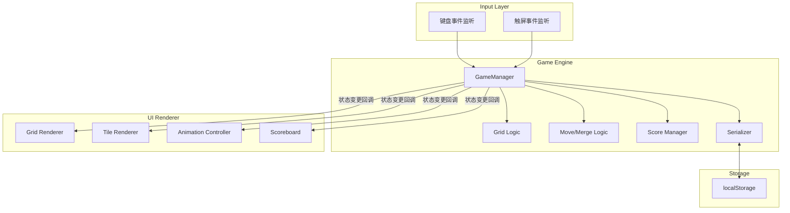

# 技术设计文档：网页版2048游戏

## 概述

本设计文档描述网页版2048滑动拼图游戏的技术实现方案。游戏采用纯HTML/CSS/JavaScript实现，无任何框架依赖，运行在现代浏览器中。

核心设计原则：
- **关注点分离**：Game Engine（游戏引擎）负责纯逻辑计算，UI Renderer（界面渲染器）负责DOM操作和动画
- **状态驱动**：所有UI更新由游戏状态变化驱动，Engine不直接操作DOM
- **可测试性**：核心逻辑（移动、合并、分数计算）为纯函数，便于单元测试和属性测试

技术选型：
- HTML5 + CSS3 + Vanilla JavaScript (ES6+)
- CSS Grid 布局 + CSS Transitions/Animations
- localStorage 用于持久化
- 无构建工具依赖，单页面应用

## 架构

系统采用两层架构，通过事件/回调机制解耦：



数据流：
1. 用户输入（键盘/触屏）→ InputHandler 解析方向
2. GameManager 调用 Move/Merge Logic 计算新状态
3. GameManager 更新 Score，检测 Game Over / Win
4. GameManager 通知 UI Renderer 渲染新状态
5. Serializer 将状态持久化到 localStorage

## 组件与接口

### 1. GameManager（游戏管理器）

游戏的核心控制器，协调所有模块。

```javascript
class GameManager {
  constructor(size = 4, renderer, storageManager)
  
  // 公共方法
  setup()           // 初始化/重启游戏
  move(direction)   // 执行移动操作，direction: 0=上, 1=右, 2=下, 3=左
  getState()        // 返回当前游戏状态快照
  
  // 内部状态
  grid              // Grid 实例
  score             // 当前分数
  bestScore         // 最高分
  over              // 是否游戏结束
  won               // 是否已达到2048
  keepPlaying       // 达到2048后是否继续
}
```

### 2. Grid（网格）

管理4x4网格的数据结构和基本操作。

```javascript
class Grid {
  constructor(size = 4, previousState = null)
  
  // 公共方法
  emptyCells()              // 返回所有空位置 [{x, y}, ...]
  randomAvailableCell()     // 返回一个随机空位置
  cellAvailable(pos)        // 检查指定位置是否为空
  cellContent(pos)          // 返回指定位置的Tile或null
  insertTile(tile)          // 在指定位置插入方块
  removeTile(tile)          // 移除指定方块
  eachCell(callback)        // 遍历所有单元格
  serialize()               // 序列化为纯数据对象
}
```

### 3. Tile（方块）

表示网格中的一个数字方块。

```javascript
class Tile {
  constructor(position, value = 2)
  
  position          // {x, y} 当前位置
  value             // 数值（2, 4, 8, ... 2048+）
  previousPosition  // 移动前的位置（用于动画）
  mergedFrom        // 合并来源的两个Tile（用于动画）
  
  savePosition()    // 保存当前位置到previousPosition
  updatePosition(pos) // 更新位置
  serialize()       // 序列化为 {position, value}
}
```

### 4. InputHandler（输入处理器）

统一处理键盘和触屏输入。

```javascript
class InputHandler {
  constructor(gameManager)
  
  listen()                  // 绑定事件监听
  handleKeyDown(event)      // 处理键盘事件
  handleTouchStart(event)   // 记录触摸起点
  handleTouchEnd(event)     // 计算滑动方向
  bindButtonEvents()        // 绑定按钮事件（新游戏、继续）
}
```

触屏方向判定逻辑：
- 滑动距离 > 30px 才触发
- 比较水平位移绝对值和垂直位移绝对值，取较大者为主方向

### 5. UIRenderer（界面渲染器）

负责将游戏状态渲染到DOM。

```javascript
class UIRenderer {
  constructor(containerSelector)
  
  render(state)             // 根据状态渲染整个界面
  updateScore(score)        // 更新分数显示
  updateBestScore(best)     // 更新最高分显示
  showMessage(won)          // 显示游戏结束/胜利消息
  clearMessage()            // 清除消息
}
```

### 6. StorageManager（存储管理器）

封装localStorage操作。

```javascript
class StorageManager {
  getGameState()            // 读取游戏状态
  setGameState(state)       // 保存游戏状态
  clearGameState()          // 清除游戏状态
  getBestScore()            // 读取最高分
  setBestScore(score)       // 保存最高分
}
```


## 数据模型

### 游戏状态（GameState）

```javascript
{
  grid: {
    size: 4,
    cells: [
      // 4x4数组，每个元素为 null 或 {position: {x, y}, value: number}
      [null, {position: {x:1,y:0}, value: 2}, null, null],
      [null, null, null, null],
      [null, null, {position: {x:2,y:2}, value: 4}, null],
      [null, null, null, null]
    ]
  },
  score: 0,
  bestScore: 0,
  over: false,
  won: false,
  keepPlaying: false
}
```

### 网格坐标系

```
     x →  0   1   2   3
  y ↓  ┌───┬───┬───┬───┐
   0   │   │   │   │   │
       ├───┼───┼───┼───┤
   1   │   │   │   │   │
       ├───┼───┼───┼───┤
   2   │   │   │   │   │
       ├───┼───┼───┼───┤
   3   │   │   │   │   │
       └───┴───┴───┴───┘
```

- `cells[x][y]` 表示第x列第y行的方块
- 方向映射：0=上(y递减), 1=右(x递增), 2=下(y递增), 3=左(x递减)

### 移动与合并算法

核心算法处理单行/列的移动合并，然后对4行/列分别应用：

```
moveLineLeft([2, 2, 4, 4]) → [4, 8, 0, 0]  // 合并后得分 +4 +8 = 12

算法步骤（以向左移动一行为例）：
1. 过滤掉空位（0），得到非空方块序列 [2, 2, 4, 4]
2. 从左到右扫描：
   a. 如果当前方块与下一个方块值相同，合并为双倍值，标记已合并
   b. 已合并的方块不再参与后续合并
3. 用0填充剩余位置至原始长度
```

对于四个方向的移动，通过坐标变换统一为"向左移动"：
- 上：转置网格 → 向左移动 → 转置回来
- 右：每行反转 → 向左移动 → 每行反转回来
- 下：转置 → 每行反转 → 向左移动 → 每行反转 → 转置
- 左：直接向左移动

### 方块生成概率

| 方块值 | 概率 |
|--------|------|
| 2      | 90%  |
| 4      | 10%  |

### localStorage 数据格式

```javascript
// key: "gameState"
{
  grid: { size: 4, cells: [[...], [...], [...], [...]] },
  score: 1234,
  over: false,
  won: false,
  keepPlaying: false
}

// key: "bestScore"
5678
```

### 方块颜色映射

| 数值 | 背景色  | 文字色  |
|------|---------|---------|
| 2    | #eee4da | #776e65 |
| 4    | #ede0c8 | #776e65 |
| 8    | #f2b179 | #f9f6f2 |
| 16   | #f59563 | #f9f6f2 |
| 32   | #f67c5f | #f9f6f2 |
| 64   | #f65e3b | #f9f6f2 |
| 128  | #edcf72 | #f9f6f2 |
| 256  | #edcc61 | #f9f6f2 |
| 512  | #edc850 | #f9f6f2 |
| 1024 | #edc53f | #f9f6f2 |
| 2048 | #edc22e | #f9f6f2 |


## 正确性属性（Correctness Properties）

*正确性属性是指在系统所有有效执行中都应成立的特征或行为——本质上是对系统应做什么的形式化陈述。属性是人类可读规范与机器可验证正确性保证之间的桥梁。*

### Property 1: 方块值约束

*For any* 新生成的方块（包括初始化和移动后生成），其数值只能是2或4，不会出现其他值。

**Validates: Requirements 1.3**

### Property 2: 移动压缩性

*For any* 非空网格状态和任意移动方向，移动后每行/列中的方块应紧贴移动方向的边界，方块与边界之间以及方块之间不存在空隙（合并后的空位除外，空位只能出现在方块序列的尾部）。

**Validates: Requirements 2.1**

### Property 3: 有效移动生成新方块

*For any* 网格状态，若一次移动操作导致至少一个方块位置或数值发生变化，则移动完成后网格中的方块总数应比移动后（生成新方块前）的方块数恰好多1。

**Validates: Requirements 2.3**

### Property 4: 无效移动为空操作

*For any* 网格状态和移动方向，若该方向的移动不会导致任何方块位置或数值变化，则移动后的网格状态应与移动前完全相同，且不生成新方块。

**Validates: Requirements 2.4**

### Property 5: 游戏结束状态阻止移动

*For any* 处于Game_Over状态的游戏和任意移动方向，执行移动操作后游戏状态应保持不变。

**Validates: Requirements 2.5**

### Property 6: 合并正确性

*For any* 包含方块的行/列，执行单方向移动时：(a) 两个相邻且数值相同的方块合并后产生的新方块数值为原数值的两倍；(b) 在同一次移动中，任何方块最多参与一次合并（已合并产生的方块不会在同一次移动中再次合并）。

**Validates: Requirements 3.1, 3.3**

### Property 7: 分数与合并一致性

*For any* 网格状态和移动操作，该次移动导致的分数增量应等于本次移动中所有合并产生的新方块数值之和。

**Validates: Requirements 4.2**

### Property 8: 最高分单调性

*For any* 游戏操作序列，bestScore在任意时刻都满足：(a) bestScore >= score；(b) bestScore只增不减（单调递增）。

**Validates: Requirements 4.4**

### Property 9: 游戏结束检测正确性

*For any* 4x4网格状态，当且仅当网格中没有空位置且没有任何水平或垂直相邻的方块数值相同时，游戏结束检测函数应返回true。

**Validates: Requirements 5.2**

### Property 10: 触屏方向识别

*For any* 触摸起点和终点坐标对，若两点间欧氏距离大于30px，则识别的方向应为位移绝对值较大的轴方向（水平或垂直）；若距离不超过30px，则不应触发任何移动操作。

**Validates: Requirements 2.2, 9.2, 9.3**

### Property 11: 游戏状态序列化往返一致性

*For any* 有效的游戏状态对象（包含grid、score、over、won、keepPlaying），将其序列化为JSON后再反序列化，应产生与原始状态等价的游戏状态。

**Validates: Requirements 10.4**

## 错误处理

### 存储错误

| 场景 | 处理方式 |
|------|----------|
| localStorage不可用（隐私模式） | 捕获异常，游戏正常运行但不持久化，控制台输出警告 |
| localStorage存储空间已满 | 捕获QuotaExceededError，清除旧存档后重试 |
| 存档数据损坏/格式无效 | JSON.parse失败时清除存档，按新游戏初始化 |

### 输入错误

| 场景 | 处理方式 |
|------|----------|
| 非方向键按键 | 忽略，不触发任何操作 |
| 触屏滑动距离过短（≤30px） | 忽略，不触发移动 |
| 动画进行中的输入 | 加入队列，动画完成后依次处理 |
| 游戏结束后的移动输入 | 忽略所有移动操作 |

### 状态异常

| 场景 | 处理方式 |
|------|----------|
| 网格数据不一致 | 重新初始化游戏 |
| 分数为负数 | 重置为0 |
| 方块值非2的幂次方 | 清除异常方块，记录警告 |

## 测试策略

### 双重测试方法

本项目采用单元测试与属性测试相结合的策略，确保全面覆盖：

- **单元测试**：验证具体示例、边界情况和错误条件
- **属性测试**：验证在所有有效输入上成立的通用属性

两者互补：单元测试捕获具体bug，属性测试验证通用正确性。

### 属性测试配置

- **测试库**：[fast-check](https://github.com/dubzzz/fast-check)（JavaScript属性测试库）
- **每个属性测试最少运行100次迭代**
- **每个测试必须用注释标注对应的设计属性**
- 标注格式：`// Feature: web-2048-game, Property {number}: {property_text}`
- **每个正确性属性由一个属性测试实现**

### 单元测试范围

| 测试类别 | 测试内容 |
|----------|----------|
| 初始化 | 新游戏创建4x4网格，恰好2个初始方块，分数为0 (Req 1.1, 1.2, 4.1) |
| 合并优先级 | [2,2,2,0]向左→[4,2,0,0]，验证方向优先合并 (Req 3.2) |
| 胜利检测 | 合并产生2048时设置won标志 (Req 3.4) |
| 游戏重启 | 点击新游戏后网格重置，分数归零 (Req 6.2, 6.3) |
| 存档恢复 | localStorage有有效存档时正确恢复 (Req 10.2) |
| 无存档启动 | localStorage无存档时初始化新游戏 (Req 10.3) |
| 键盘映射 | 方向键正确映射到移动方向 (Req 9.1) |

### 属性测试范围

| 属性编号 | 测试描述 | 生成器 |
|----------|----------|--------|
| Property 1 | 方块值约束 | 随机网格状态 + 随机方向 |
| Property 2 | 移动压缩性 | 随机非空行/列数组 |
| Property 3 | 有效移动生成新方块 | 随机非满网格 + 随机方向（确保有效移动） |
| Property 4 | 无效移动为空操作 | 随机网格 + 随机方向（筛选无效移动） |
| Property 5 | 游戏结束阻止移动 | 随机Game_Over状态网格 + 随机方向 |
| Property 6 | 合并正确性 | 随机行/列（含可合并方块对） |
| Property 7 | 分数与合并一致性 | 随机网格 + 随机方向 |
| Property 8 | 最高分单调性 | 随机操作序列 |
| Property 9 | 游戏结束检测 | 随机满网格（有/无相邻相同方块） |
| Property 10 | 触屏方向识别 | 随机坐标对 |
| Property 11 | 序列化往返一致性 | 随机有效GameState对象 |

### 测试文件结构

```
tests/
  game/
    game-engine.test.js      # 单元测试：核心逻辑
    grid.test.js             # 单元测试：网格操作
    properties.test.js       # 属性测试：所有11个正确性属性
    input-handler.test.js    # 单元测试：输入处理
    storage.test.js          # 单元测试：存储管理
```

### 关键生成器设计

```javascript
// 随机有效方块值生成器
const tileValueArb = fc.constantFrom(2, 4, 8, 16, 32, 64, 128, 256, 512, 1024, 2048);

// 随机网格单元格生成器（null或方块值）
const cellArb = fc.oneof(fc.constant(null), tileValueArb);

// 随机4x4网格生成器
const gridArb = fc.array(fc.array(cellArb, {minLength:4, maxLength:4}), {minLength:4, maxLength:4});

// 随机方向生成器
const directionArb = fc.constantFrom(0, 1, 2, 3); // 上右下左

// 随机GameState生成器
const gameStateArb = fc.record({
  grid: gridArb,
  score: fc.nat(),
  over: fc.boolean(),
  won: fc.boolean(),
  keepPlaying: fc.boolean()
});
```
